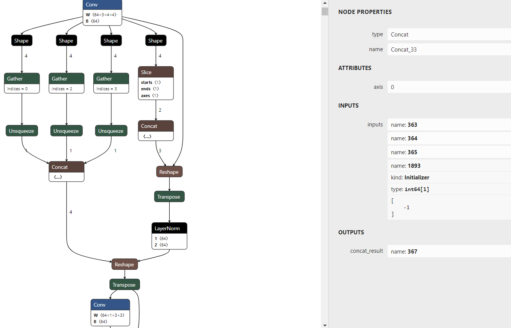
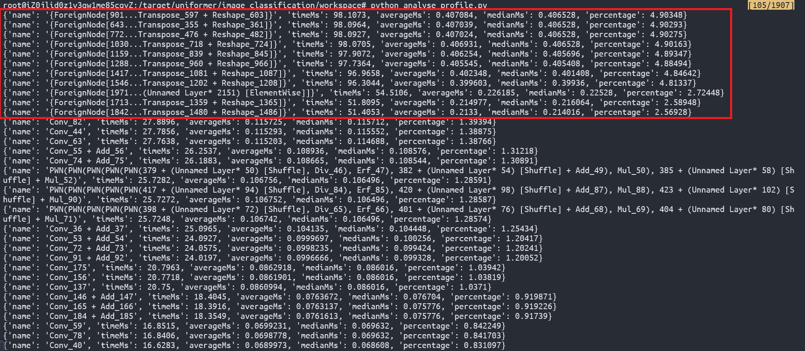
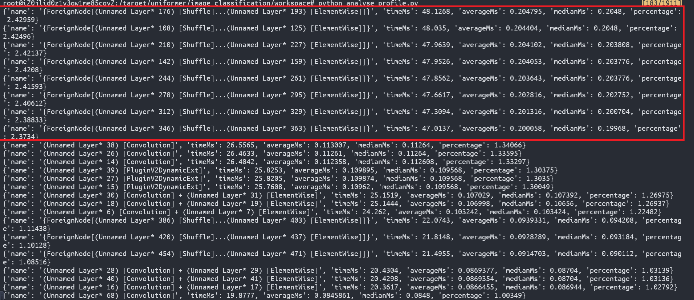

# TensorRT Hackathon 2022

## 总述
---
### 原始模型名称及链接
模型：**UniFormer**(**Uni**fied trans**Former**)

论文：https://arxiv.org/pdf/2201.09450.pdf

代码：https://github.com/Sense-X/UniFormer
### 优化效果

相比pytorch原生模型，在尽量保证精度的同时，经过优化后的tensorrt模型在small batch size的情况下降低了至多80%的推理延迟，在large batch size的情况下推理延迟也能降低40%。

### 运行步骤

#### 拉取docker image
```
docker pull registry.cn-hangzhou.aliyuncs.com/trt2022/trt-8.4-ga:latest
```

#### 下载代码并安装依赖
```
git clone https://github.com/shuo-ouyang/trt-hackathon-2022.git
cd trt-hackathon-2022
pip install -r requirements.txt
```

#### 编译plugin
```
cd plugins/LayerNormPlugin && make clean && make all
cd plugins/GeluPlugin && make clean && make all
```

#### 下载或生成校准数据集

模型可以[点击这里](https://drive.google.com/file/d/1-uepH3Q3BhTmWU6HK-sGAGQC_MpfIiPD/view?usp=sharing)进行下载。

可以点击[此链接](https://pan.baidu.com/s/1quVHc52-nUNmEvYbMl7zSw)（提取码：2191）下载校准和测试数据集，或者自己在imagenet validataion上构建校准数据集。校准数据集需要存放在`/workspace/calibration`目录下。

生成校准数据集
```
cd /workspace && mkdir calibration
python gen_calib_data.py --imgnet-val your-imagenet-val-path
```

#### onnx2trt模型构建
```
python export_onnx.py --use-fp16
python process_onnx.py --use-fp16 --use-ln --use-gelu --onnx uf_small.onnx --output uf_opt.onnx
python onnx2trt.py
```

#### trt api模型构建
我们通过trt api实现的模型仅支持静态shape，所以trt_model.py会给不同batch size都构建一个engine。
```
python trt_model.py
```

#### 测试pytorch/tensorrt模型性能
```
python test_speedup.py --engine uf.plan
```

## 原始模型
---
### 模型简介
对于图像和视频上的representation learning而言，目前存在两大痛点：
- local redundancy: 视觉数据在局部空间/时间/时空邻域具有相似性，这种局部性质容易引入大量低效的计算。
- global dependency: 要实现准确的识别，需要动态地将不同区域中的目标关联，建模长时依赖。

现有的两大主流模型CNN和ViT，往往只关注解决以上部分问题。Convolution只在局部小邻域聚合上下文，天然地避免了冗余的全局计算，但受限的感受野也难以建模全局依赖。而self-attention通过比较全局相似度，将长距离目标关联，但ViT在浅层编码局部特征十分低效。相较而言，convolution在提取这些浅层特征时，无论是在效果上还是计算量上都具有显著的优势。那么为何不针对网络不同层特征的差异，设计不同的特征学习算子，从而将convolution和self-attention有机地结合起来，各取所长、物尽其用呢？

UniFormer以Transformer的风格，有机地统一convolution和self-attention，发挥二者的优势，同时解决local redundancy和global dependency两大问题，从而实现高效的特征学习。


模型整体框架如上图所示。Uniformer借鉴了CNN的层次化设计，每层包含多个Transformer风格的UniFormer Block。每个UniFormer Block都由三部分组成：动态位置编码DPE、多头关系聚合器MHRA以及前馈层FFN。

### 模型优化的难点

相比于传统的CNN模型（如ResNet50），基于Transformer的模型在控制FLOPS的同时能够取得不错的精度优势。但是，限制一个模型能否商用落地更多的是延迟（Latency）。

| 模型        | 精度    | FP32/FP16推理延迟（倍数关系） | FP32/FP16显存占用 |
|:---------:|:-----:|:-------------------:|:-------------:|
| ResNet50  | 79.1% | 3/1                 | 636MB/579MB   |
| Uniformer | 82.9% | 4.8/3               | 742MB/676MB   |

从上表[1]中可以看到，Uniformer在FP32和FP16下的推理延迟都高于ResNet50，而且Uniformer对量化不友好，FP16的推理延迟只有FP32的62.5%。因此，本次复赛的目标是在保证精度的情况下，基于TensorRT优化Uniformer的推理延迟。

本次比赛，我们选取的模型是针对图像分类任务的uniformer small模型，它有一个输入和一个输出，输入的维度是(batch, 3, height, width)， 输出的维度是(batch, 1000)。基于onnx模型构建tensorrt egine时，因为输入的height与width是动态的，所以会遇到下面的问题，报错信息是conv算子的group count没有被输入的channel数整除。
```
[06/13/2022-14:53:26] [E] Error[4]: [convolutionNode.cpp::computeOutputExtents::36] Error Code 4: Internal Error (Conv_36: group count must divide input channel count)
[06/13/2022-14:53:26] [E] [TRT] parsers/onnx/ModelImporter.cpp:780: While parsing node number 36 [Conv -> "370"]:
[06/13/2022-14:53:26] [E] [TRT] parsers/onnx/ModelImporter.cpp:781: --- Begin node ---
[06/13/2022-14:53:26] [E] [TRT] parsers/onnx/ModelImporter.cpp:782: input: "369"
input: "blocks1.0.pos_embed.weight"
input: "blocks1.0.pos_embed.bias"
output: "370"
name: "Conv_36"
op_type: "Conv"
attribute {
  name: "dilations"
  ints: 1
  ints: 1
  type: INTS
}
attribute {
  name: "group"
  i: 64
  type: INT
}
attribute {
  name: "kernel_shape"
  ints: 3
  ints: 3
  type: INTS
}
attribute {
  name: "pads"
  ints: 1
  ints: 1
  ints: 1
  ints: 1
  type: INTS
}
attribute {
  name: "strides"
  ints: 1
  ints: 1
  type: INTS
}

[06/13/2022-14:53:26] [E] [TRT] parsers/onnx/ModelImporter.cpp:783: --- End node ---
[06/13/2022-14:53:26] [E] [TRT] parsers/onnx/ModelImporter.cpp:785: ERROR: parsers/onnx/ModelImporter.cpp:166 In function parseGraph:
[6] Invalid Node - Conv_36
[convolutionNode.cpp::computeOutputExtents::36] Error Code 4: Internal Error (Conv_36: group count must divide input channel count)
```

观察onnx计算图可以发现，LayerNorm的输出会被Reshape成一个4维tensor再Transpose(0,3,1,2)后输入给Conv节点，而新的shape是通过Concat得到的。可以看到，图中Concat_33节点的最后一维是-1，经过Transpose后它会被当做channel输入给Conv节点，从而导致上面的错误。

观察LayerNorm节点的操作流程，可知该节点输出的shape是(batch, -1, 64)，而64正好等于Conv节点的group，因此我们可以合理猜测将Conv输入的channel设置为LayerNorm输出的最后一维能够解决此问题。通过把Conv节点的输入设置成匹配的值，就可以成功构建tensorrt engine了。

## 优化过程
---

#### Self Attention算子优化
在构建好tensorrt engine以后，我们首先通过一些profile工具观察下整个网络模型推理过程中的性能瓶颈。这里，我们通过`trtexec`命令，配合`--dumpProfile`以及`--exportProfile`等选项，来剖析tensorrt engine的瓶颈。`--exportProfile`选项可以将engine运行过程中每一层的推理耗时保存到json文件中。通过对每个算子在推理过程的时间占比进行排序，就能够得知模型的瓶颈在哪里。从下面的图片中可以看出，模型中耗时最多的是self attention算子（它在tensorrt中是由多个算子融合而来），这些self attention算子占整个模型推理耗时的50%左右，着实是一笔巨大的开销。



一般来说，针对这种问题，比较好的解决方案是实现self attention plugin。TensorRT官方提供了一个bertQKV2CTX的plugin，它前后各接一个fc就能够实现self attention的计算。秉承着不要重复造轮子的原则，我们希望能够将这个plugin接入到网络模型中。不幸的是，我们在接入此plugin时遇到了两个问题。首先是plugin的输出无法跟pytorch对齐，再就是uniformer中的self attention算子在qkv的fc层过后，会进行reshape+transpose的操作，这个在plugin中也是没有支持的。为了解决此问题，我们决定用tensorrt python api重新搭建uniformer。

如下所示，通过tensorrt python api构建的self attention算子的运行时间占比有了显著的下降，这说明我们的优化是有效的。具体精度和加速效果见下一节。



#### INT8模型量化
观察uniformer的模型结构以及代码实现，可以发现其中有非常多的2d卷积操作。众所周知，2d卷积非常适合做INT8量化，而且tensorrt对INT8的支持也很好，所以INT8是提升推理性能的利器。这里由于硬盘空间的限制，我们无法上传imagenet训练数据集，因此无法进行QAT，所以我们将重点放在PTQ这种量化方式上。

PTQ的关键在于校准数据集的选择。这里我们在validation数据集中随机选择了5120张图片作为校准数据集。我们使用`IInt8EntropyCalibrator`来寻找每一层的minmax。

这里有一点需要注意，一般来说，因为模型的输出层需要输出所有类别的概率，所以它不能被INT8量化，否则会有非常严重的掉点。

## 精度与加速效果
---
公平起见，在比较pytorch与tensorrt的推理速度时，我们会分别比较FP32与FP16的精度与速度，即比较pytorch和tensorrt均为FP32时的精度和速度，或它俩同时为FP16时的精度和速度。在INT8模式下，我们会比较tensorrt FP32/FP16/INT8之间的精度和速度。

我们主要比较三种模型的推理延迟，分别是pytorch原生模型，基于onnx构建的tensorrt模型（下文简称为onnx2trt），以及通过tensorrt api搭建的模型（下文简称trt api）。

#### PyTorch FP32 vs TensorRT FP32
首先，我们给出了pytorch/onnx2trt/trt api三者的推理延迟（单位:ms）以及onnx2trt和trt api相比于pytorch的性能提升。可以看到，onnx不加任何优化构建出的trt engine就能够有比较不错的加速效果，然而通过trt api搭建的模型能够取得更好的加速效果。
| batch size | pytorch latency | onnx2trt lantency | trt api latency |
|:----------:|:---------------:|:-----------------:|:---------------:|
| 1          | 8.642           | 5.113(+42.3%)     |  2.105(+80.0%)  |
| 2          | 9.469           | 3.116(+67.1%)     |  2.881(+69.6%)  |
| 3          | 9.646           | 4.314(+55.3%)     |  3.894(+59.6%)  |
| 4          | 9.638           | 4.847(+49.7%)     |  4.768(+50.5%)  |
| 8          | 11.676          | 8.376(+28.3%)     |  8.349(+28.5%)  |
| 16         | 23.502          | 16.408(+30.2%)    |  16.167(+31.2%) |
| 32         | 44.669          | 31.691(+29.1%)    |  29.737(+33.4%) |


在精度方面，pytroch与onnx2trt模型的精度基本吻合，onnx2trt没有发生比较严重的掉点。然而trt api相比与前二者掉了大概3个点左右，猜测可能是搭模型的时候漏了哪一层导致精度拉了？
| pytorch | onnx2trt | trt api |
|:-------:|:--------:|:-------:|
| 82.886  |  82.879  | 79.856  |

#### PyTorch FP16 vs TensorRT FP16
接下来比较pytorch与tensorrt在FP16模式下的精度与速度。可以看到，pytroch FP16在batch size较小时表现不如pytorhc FP32，但是在batch size=16/32时推理性能优于FP32。类似FP32的情况，onnx2trt和trt api相比与pytroch模型都有一定的性能提升，并且trt api优于onnx2trt的性能。
| batch size | pytorch latency | onnx2trt lantency | trt api latency |
|:----------:|:---------------:|:-----------------:|:---------------:|
| 1          |     10.642      | 2.537(+76.2%)     |  1.696(+84.1%)  |
| 2          |     11.008      | 2.924(+73.4%)     |  2.091(+81.0%)  |
| 3          |     11.068      | 3.471(+68.6%)     |  2.644(+76.1%)  |
| 4          |     11.640      | 3.834(+67.1%)     |  3.105(+73.3%)  |
| 8          |     11.708      | 6.337(+45.9%)     |  5.472(+53.5%)  |
| 16         |     16.042      | 12.583(+21.6%)    |  10.022(+37.5%) |
| 32         |     31.602      | 24.473(+22.6%)    |  19.470(+38.4%) |

三者的Top1精度如下表所示，结果与FP32的精度类似，没有发生明显的掉点。
| pytorch | onnx2trt | trt api |
|:-------:|:--------:|:-------:|
| 82.880  |  82.867  |  79.852 |


#### TensorRT FP32 vs TensorRT FP16 vs TensorRT INT8
因为pytroch原生不能跑INT8 forward，所以这里就没有比较pytroch的性能，而是比较了tensorrt FP32/FP16/INT8的推理性能。因为trt api搭建的模型只在batch size=16的情况下构建出了engine，所以只比较了此batch size下的性能。从下表可以看出，trt api搭建的模型在FP16的精度下表现最好，不同batch size下推理的latency都是最小的。

| batch size |  onnx2trt FP32  |  onnx2trt FP16  |   onnx2trt INT8   |  trt api FP32  |  trt api FP16  |   trt api INT8  |
|:----------:|:---------------:|:---------------:|:-----------------:|:--------------:|:--------------:|:---------------:|
| 1          |      5.133      |      2.537      |       2.363       |     2.105      |    **1.696**  |        X        |
| 2          |      3.116      |      2.924      |       2.766       |     2.881      |    **2.091**  |        X        |
| 3          |      4.314      |      3.471      |       3.274       |     3.894      |    **2.644**  |        X        |
| 4          |      4.874      |      3.834      |       3.538       |     4.768      |    **3.105**  |        X        |
| 8          |      8.376      |      6.337      |       5.756       |     8.349      |    **5.472**  |        X        |
| 16         |      16.408     |     12.583      |       12.038      |     16.167     |   **10.022**  |      13.219     |
| 32         |      31.691     |     24.473      |       23.227      |     29.737     |   **19.470**  |        X        |


下表是tensorrt模型INT8模式下的Top1精度，可以看到，相比于FP32/FP16，INT8模型掉了大概2个点左右，还算是在可以接受的范围内吧。
| pytorch | onnx2trt | trt_api |
|:-------:|:--------:|:-------:|
|    X    |  81.072  |  76.208 |

## 心得与体会
---
用tensorrt api搭模型真有意思，争取后面把针对目标检测任务的uniformer也搭出来。

## References
>[1] https://bbs.huaweicloud.com/blogs/327738
